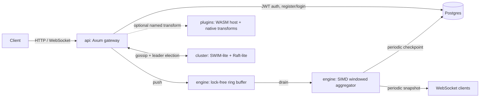

# Vortex

A distributed, WASM-pluggable real-time stream-processing engine — built end to end in Rust as a deliberate tour through the language's hardest corners: lock-free concurrency, `unsafe`, procedural macros, a hand-rolled distributed-systems layer, and SIMD, each one load-bearing rather than decorative.

Think "a small, honest slice of Kafka + Flink + a WASM plugin host." Built in nine phases, each with real evidence behind it — a test that would actually fail if the implementation were wrong — rather than a claim taken on faith.

---

## Table of contents

- [Why this exists](#why-this-exists)
- [Architecture](#architecture)
- [Crate breakdown](#crate-breakdown)
- [What each phase actually proved](#what-each-phase-actually-proved)
- [How the hard parts actually work](#how-the-hard-parts-actually-work)
  - [The lock-free ring buffer](#the-lock-free-ring-buffer)
  - [Gossip membership and leader election](#gossip-membership-and-leader-election)
  - [The `#[transform]` macro, expanded](#the-transform-macro-expanded)
  - [The WASM plugin ABI](#the-wasm-plugin-abi)
  - [SIMD windowed aggregation](#simd-windowed-aggregation)
- [Key design decisions (and their tradeoffs)](#key-design-decisions-and-their-tradeoffs)
- [Real bugs caught during the build](#real-bugs-caught-during-the-build)
- [Benchmark: SIMD vs scalar aggregation](#benchmark-simd-vs-scalar-aggregation)
- [API reference with examples](#api-reference-with-examples)
- [Running it locally](#running-it-locally)
- [Running the tests](#running-the-tests)
- [Troubleshooting](#troubleshooting)
- [Known limitations](#known-limitations)
- [Dependency notes](#dependency-notes)
- [Roadmap](#roadmap)
- [Project layout](#project-layout)

---

## Why this exists

Most portfolio projects touch a Rust concept once, shallowly — an `unsafe` block here, an `async fn` there. This one was built the other way: pick a small number of genuinely hard subsystems, and prove each one actually works, rather than claim breadth for its own sake.

Every hard piece in this project has a test that would fail if the implementation were wrong, not just a test that confirms it compiles:

- The lock-free ring buffer is checked with **`loom`**, which exhaustively explores thread interleavings rather than sampling them.
- The 3-node leader election spins up **real async nodes on real localhost UDP sockets** and asserts they converge on exactly one leader.
- The WASM plugin host is proven against a **hand-written WAT module** that round-trips real bytes through real sandboxed linear memory.
- The SIMD aggregation path has a **`criterion` benchmark** in the repo, not just a claim.
- The whole gateway — auth, ingestion, aggregation, persistence — is exercised in **one integration test against a real, disposable Postgres** (via `testcontainers`), hitting real HTTP endpoints through the real router.

Where building this honestly meant cutting scope, the cut is documented, not hidden — see [Key design decisions](#key-design-decisions-and-their-tradeoffs).

---

## Architecture



**Request flow for `POST /ingest`:** the request is authenticated (JWT), optionally passed through a named transform (native, macro-registered, or WASM-loaded), pushed onto a lock-free ring buffer, then asynchronously drained into a SIMD-backed per-`(stream_id, window)` aggregator. Every few seconds, the current aggregation state is checkpointed to Postgres and broadcast to any subscribed WebSocket clients.

---

## Crate breakdown

| Crate | Responsibility | Rust concept it exists to prove |
|---|---|---|
| `domain` | `Event<'a>`, `Window`, `Transform` trait, `DomainError` — pure logic, zero I/O | ownership, lifetimes, generics, trait objects |
| `engine` | Lock-free MPMC ring buffer, SIMD windowed aggregation, write-ahead log | `unsafe`, atomics, portable SIMD (via the `wide` crate) |
| `cluster` | UDP gossip membership (SWIM-lite), leader election (Raft-lite, election-only) | distributed systems, async, deterministic tie-breaking |
| `macros` | `#[transform]` procedural attribute macro | procedural macros, `inventory`-based compile-time-to-runtime registration |
| `plugins` | WASM plugin host (`wasmtime`), transform registry | dynamic dispatch, a hand-defined host/guest ABI |
| `infra` | Config loading, `CheckpointRepo` (Postgres persistence) | kept as a leaf crate — knows *how* to talk to Postgres, not *what* the data means |
| `api` | Axum HTTP/WS gateway: JWT auth, ingestion, query, checkpoints, cluster status, rate limiting | ties every other crate together behind real endpoints; split into `lib.rs` + thin `main.rs` specifically so it's testable |

Dependency direction is strictly one-way: `domain` depends on nothing else in the workspace; `engine`, `cluster`, and `plugins` depend only on `domain`; `infra` is a leaf with no dependency on business-logic crates; `api` is the only crate that knows about everything.

---

## What each phase actually proved

| Phase | What it built | The evidence |
|---|---|---|
| 0 – 1 | Cargo workspace, config loading, `Event`/`Window`/`Transform`/`DomainError` | Clean workspace build |
| 2 | Lock-free MPMC ring buffer (Vyukov's algorithm) | `loom` model-checks the concurrency logic exhaustively |
| 3 | UDP gossip (SWIM-lite) + leader election (Raft-lite) | 3 real async nodes on real sockets, asserted convergence on one leader, including a deterministic bootstrap tie-break |
| 4 | `#[transform]` proc macro + `inventory` registry + WASM plugin host | Macro→registry pipeline proven end to end; WASM round-trip proven against a hand-written WAT module |
| 5 | SIMD windowed aggregation | `criterion` benchmark with real numbers; correctness sweep across SIMD lane-width boundary sizes |
| 6 | Axum API gateway: JWT auth, ingest, query, cluster status, WebSocket stream | Auth extractor tested directly (valid token, missing header, wrong secret) |
| 7 | Postgres checkpoint persistence | A real cross-stream aggregation bug was caught and fixed here |
| 8 | `api` split into `lib.rs` + `main.rs`; full-stack integration test | One test, real disposable Postgres, exercises the entire gateway through the real HTTP router |
| 9 | Rate limiting, graceful shutdown, `cargo-deny`, Dockerfile, this README | Hand-rolled rate limiter with its own unit tests; `CancellationToken`-based shutdown that actually drains background work |

---

## How the hard parts actually work

### The lock-free ring buffer

`engine::RingBuffer<T>` is Dmitry Vyukov's bounded MPMC queue algorithm. The key idea: instead of one global head/tail pair guarded by a lock, **every slot carries its own sequence number**. A thread claims a slot by CAS-ing a cursor forward; once it owns that slot (the CAS succeeded), no other thread can touch it until the owner bumps the slot's sequence number to hand it off.

```
Slot:  [ sequence: AtomicUsize | value: UnsafeCell<MaybeUninit<T>> ]

push(v):
  1. load enqueue_pos
  2. look at buffer[pos & mask].sequence
  3. if sequence == pos:        the slot is free, try to claim it
       CAS enqueue_pos: pos -> pos+1
       on success: write v into the slot, then sequence = pos+1
                   (this second store is what "hands off" the slot to a consumer)
  4. if sequence < pos:         buffer is full, return Err
  5. otherwise:                 another producer beat us to this pos, retry
```

`pop` is the mirror image, checking `sequence == pos + 1` (the value has been written and handed off) rather than `sequence == pos`.

Two `unsafe` operations happen inside a claimed slot: writing into a `MaybeUninit<T>` on push, and `assume_init_read()` on pop. Both are sound *only if* the CAS-based claiming is correct — which is exactly the property `loom` checks by exhaustively exploring interleavings of the push/pop CAS loops, rather than hoping a handful of real-thread test runs happen to hit the bad interleaving.

### Gossip membership and leader election

**Membership (`cluster::gossip`)** is a simplified SWIM: every node periodically pings one random peer over UDP and waits for an ack. A missed ack marks that peer `Suspect`; if it's still `Suspect` after a timeout, it's marked `Dead`. Every `Ack` piggybacks the sender's whole membership view, so the cluster's picture of itself converges without a separate anti-entropy pass. (Full SWIM also does *indirect* probing — asking other members to probe on your behalf before declaring Suspect, to rule out a single lossy network path. This implementation skips that; see [Known limitations](#known-limitations).)

**Leader election (`cluster::raft_lite`)** is Raft's election mechanism only, with no log replication: a `Follower` that hears no heartbeat within a randomized timeout becomes a `Candidate`, requests votes from every known peer, and becomes `Leader` on a majority. The interesting bug this had to solve: **what happens if three nodes start simultaneously**, each timing out and self-electing before gossip has introduced them to each other? Without a tiebreak, different nodes could permanently disagree about who's leader based on message arrival order alone. The fix is a deterministic rule baked into heartbeat handling: on an equal-term heartbeat collision between two self-proclaimed leaders, the lower `NodeId` wins, everywhere. That's what the 3-node integration test actually verifies — not just that *a* leader gets elected, but that all three nodes agree on the *same* one.

### The `#[transform]` macro, expanded

Writing this:

```rust
#[transform]
fn uppercase_key(event: &Event<'_>) -> Result<Vec<Event<'static>>, DomainError> {
    // ...
}
```

expands, at compile time, to roughly this:

```rust
fn uppercase_key(event: &Event<'_>) -> Result<Vec<Event<'static>>, DomainError> {
    // ...  (your original function, untouched)
}

struct UppercaseKeyTransform;

impl domain::Transform for UppercaseKeyTransform {
    fn name(&self) -> &str { "uppercase_key" }
    fn apply<'a>(&self, event: &domain::Event<'a>) -> Result<Vec<domain::Event<'static>>, domain::DomainError> {
        uppercase_key(event)
    }
}

inventory::submit! {
    domain::TransformRegistration {
        name: "uppercase_key",
        factory: || Box::new(UppercaseKeyTransform),
    }
}
```

The `inventory::submit!` call is the important part: it doesn't run at compile time, it registers a static entry that gets **linked into the final binary**. At runtime, `TransformRegistry::with_native_transforms()` calls `inventory::iter::<TransformRegistration>()`, which walks every one of these linker-collected entries across the *entire* dependency graph — meaning a new transform anywhere in the workspace becomes available automatically, with zero central "list of all transforms" file to update. This is the same category of mechanism `libtest`-style test harnesses use to discover `#[test]` functions.

### The WASM plugin ABI

Guest WASM modules aren't handed a Rust value — they get raw bytes across a linear-memory boundary, via three things the guest must export:

```
memory                         — the guest's linear memory
alloc(len: i32) -> i32         — bump-allocate `len` bytes, return the pointer
transform(ptr: i32, len: i32) -> i64   — packed (out_ptr << 32) | out_len
```

The host side (`plugins::host::WasmTransform`):

1. Serializes the input `Event` to JSON.
2. Calls the guest's `alloc` to get a pointer, writes the JSON bytes into guest memory at that pointer.
3. Calls `transform(ptr, len)`.
4. Unpacks the returned `i64` into an output pointer and length, reads those bytes back out of guest memory.
5. Deserializes the result as JSON.

This is tested against a **hand-written WAT (WebAssembly Text) module** that implements exactly this contract but does the simplest possible thing: it echoes the same ptr/len straight back. That's enough to prove the *entire* round trip — allocation, memory write, the call itself, memory read-back — actually moves real bytes through a real sandboxed guest instance, without needing a full `wasm32` Rust toolchain just to write a test.

### SIMD windowed aggregation

`engine::simd_agg::sum_simd` processes four `f64`s at a time using the `wide` crate's `f64x4` (a portable SIMD type that compiles down to real SSE/AVX/NEON instructions depending on target). The core loop:

```rust
let mut acc = f64x4::splat(0.0);
for chunk in data.chunks_exact(4) {
    acc += f64x4::from([chunk[0], chunk[1], chunk[2], chunk[3]]);
}
acc.reduce_add() + remainder.iter().sum::<f64>()   // handle the leftover < 4 elements
```

The correctness test sweeps sizes `[0, 1, 3, 4, 5, 16, 17, 1000]` — deliberately straddling the lane width of 4 in both directions, since an off-by-one in the remainder handling is exactly the kind of bug that only shows up at those boundaries, not at a comfortably-divisible size like 1000 alone.

---

## Key design decisions (and their tradeoffs)

**Raft: leader election only, no log replication.** Full log replication is where hand-rolled Raft implementations are notoriously easy to get subtly wrong (split-brain, term confusion, log divergence). A half-working consensus layer is worse for correctness — and worse to defend under questioning — than a smaller layer that's actually right.

**WASM ABI: JSON, not a binary format.** A real production system would likely use a binary wire format for performance. JSON was chosen deliberately because the ABI itself — ptr/len across the host/guest boundary — is the actually interesting part to get right; JSON keeps that verifiable without also debugging a custom binary codec at the same time.

**SIMD: `sum` only, not `min`/`max`.** A correct SIMD `min`/`max` needs a lane-wise comparison plus a horizontal reduction — a second, separately-verifiable piece of work. Shipping one path that's benchmarked and correct beats shipping two where one might be subtly wrong.

**`sqlx::query_as` (runtime), not `sqlx::query!` (compile-time-checked).** The compile-time macro needs a live, reachable database matching `DATABASE_URL` just to run `cargo build` — meaning the whole workspace would fail to compile for anyone without Postgres running locally. The runtime variant trades some compile-time SQL safety for the project being buildable everywhere; the real query behavior is what the Phase 8 integration test actually exercises.

**Rate limiting is hand-rolled, not an external crate.** After three separate dependency-API-drift incidents in one project (below), the last phase wasn't the place to gamble on a fourth. A fixed-window per-IP limiter is small enough to own outright, with its own unit tests.

---

## Real bugs caught during the build

**`WindowAggregator` silently merged all streams into one bucket.** The aggregator originally keyed windows by time range alone, discarding `stream_id` entirely. This didn't matter until Postgres persistence needed a `stream_id` to key checkpoint rows by — at which point the gap became visible. Fixed by re-keying on `(stream_id, Window)`, with a regression test (`events_from_different_streams_in_the_same_time_window_stay_separate`) specifically asserting two different streams' events in the same time window don't get summed together.

**Bootstrap split-brain in leader election** — see [Gossip membership and leader election](#gossip-membership-and-leader-election) above for the full explanation and fix.

**Three dependency-API-drift incidents**, each resolved by pinning to a known-stable version or checking real documentation rather than guessing further:
- `argon2`/`password-hash` — an unpinned `cargo add` pulled a newer major version with a reshaped `SaltString`/`hash_password` API; pinned to the well-documented `0.5` line.
- `jsonwebtoken` 11.x — moved to a pluggable crypto backend requiring an explicit `rust_crypto` or `aws_lc_rs` feature; neither was enabled by default.
- `axum`'s WebSocket support is feature-gated behind `ws`, not enabled by default.

**Axum middleware trait-bound rough edge.** Mixing a `State<S>` extractor with `Option<ConnectInfo<SocketAddr>>` on `axum::middleware::from_fn_with_state` (and even a `from_fn` closure with that same extractor signature) fails to satisfy axum 0.8.9's generated `Service` trait bounds — a genuine library rough edge, not a misuse of the API. Worked around by reading `ConnectInfo` directly out of `req.extensions()` inside the handler body instead of as a typed extractor parameter, which sidesteps the problematic code path entirely while doing the same thing.

---

## Benchmark: SIMD vs scalar aggregation

From `crates/engine/benches/simd_vs_scalar.rs` (`cargo bench -p engine`), summing `f64` slices via `wide`'s `f64x4` versus a plain scalar `.iter().sum()`:

| Input size | Scalar | SIMD | Speedup |
|---|---|---|---|
| 64 | 40.8 ns | 11.7 ns | ~3.5x |
| 1,024 | 1,127.8 ns | 276.1 ns | ~4.1x |
| 65,536 | 75,567 ns | 18,901 ns | ~4.0x |

The consistency across three orders of magnitude of input size — tracking close to the theoretical ~4x ceiling from processing 4 `f64` lanes per instruction — is itself evidence the SIMD path isn't paying some hidden overhead that erodes the gain at small sizes.

---

## API reference with examples

All endpoints except `/auth/register` and `/auth/login` require `Authorization: Bearer <token>`. Base URL assumed: `http://localhost:8080`.

### Register

```bash
curl -X POST http://localhost:8080/auth/register \
  -H "Content-Type: application/json" \
  -d '{"username": "alice", "password": "hunter42"}'
# → { "token": "eyJhbGciOi..." }
```

### Login

```bash
curl -X POST http://localhost:8080/auth/login \
  -H "Content-Type: application/json" \
  -d '{"username": "alice", "password": "hunter42"}'
```

### Ingest an event

`payload_b64` is a base64-encoded little-endian `f64` array. Example: encoding the single value `5.0`:

```bash
TOKEN="eyJhbGciOi..."
PAYLOAD=$(python3 -c "import struct, base64; print(base64.b64encode(struct.pack('<d', 5.0)).decode())")

curl -X POST http://localhost:8080/ingest \
  -H "Content-Type: application/json" \
  -H "Authorization: Bearer $TOKEN" \
  -d "{\"stream_id\": 1, \"timestamp_ms\": 500, \"key\": \"sensor-a\", \"payload_b64\": \"$PAYLOAD\"}"
# → { "accepted": true }
```

To run a transform (native or WASM-loaded) before ingestion, add `"transform": "uppercase_key"` to the body.

### Query current aggregates

```bash
curl "http://localhost:8080/query?stream_id=1" \
  -H "Authorization: Bearer $TOKEN"
# → [ { "stream_id": 1, "start_ms": 0, "end_ms": 1000, "count": 1, "sum": 5.0, "mean": 5.0, "min": 5.0, "max": 5.0 } ]
```

### List persisted checkpoints

```bash
curl "http://localhost:8080/checkpoints?stream_id=1" \
  -H "Authorization: Bearer $TOKEN"
```

### Cluster status

```bash
curl http://localhost:8080/cluster/status
# → { "node_id": "...", "role": "Leader", "leader": "...", "members": ["..."] }
```

### Live stats over WebSocket

```bash
websocat ws://localhost:8080/stream/ws
# streams a JSON aggregation snapshot every 2 seconds
```

Full endpoint table:

| Method | Path | Auth | Description |
|---|---|---|---|
| `POST` | `/auth/register` | — | Create a user, returns a JWT |
| `POST` | `/auth/login` | — | Returns a JWT on valid credentials |
| `POST` | `/ingest` | required | Push an event, optionally through a named transform |
| `GET` | `/query` | required | Current in-memory windowed aggregates |
| `GET` | `/checkpoints` | required | Persisted checkpoint rows from Postgres |
| `GET` | `/cluster/status` | — | Gossip membership + election state |
| `GET` | `/stream/ws` | — | WebSocket aggregation stream |

Rate limit: 20 requests/second/IP, fixed-window (see [Known limitations](#known-limitations)).

---

## Running it locally

**Prerequisites:** Rust (stable), Docker (for local Postgres and for the integration test).

```powershell
# 1. Start Postgres
docker compose up -d

# 2. Copy and adjust environment config
copy .env.example .env

# 3. Run the gateway (migrations run automatically on startup)
cargo run -p api
```

The server listens on `HTTP_BIND_ADDR` (default `0.0.0.0:8080`) and joins the gossip cluster on `GOSSIP_BIND_ADDR` (default `0.0.0.0:7946`). To run a second node on the same machine for a local multi-node cluster, set a different `HTTP_BIND_ADDR`/`GOSSIP_BIND_ADDR` and point `GOSSIP_SEEDS` at the first node's gossip address.

**Docker:**

```powershell
docker build -t vortex .
docker run -p 8080:8080 --env-file .env vortex
```

---

## Running the tests

```powershell
# Everything except the loom-specific concurrency check
cargo test --workspace

# The loom model-checker on the ring buffer — exhaustive interleaving
# search, not sampling. This is the real proof, not the quick sanity check.
$env:RUSTFLAGS = "--cfg loom"
cargo test -p engine --release --lib loom_tests
Remove-Item Env:\RUSTFLAGS

# The SIMD benchmark
cargo bench -p engine

# Dependency license/advisory audit (requires `cargo install cargo-deny` first)
cargo deny check
```

`cargo test --workspace` includes `full_gateway_flow_against_a_real_postgres`, which needs Docker running (it spins up a disposable Postgres via `testcontainers`) — this is the one test that will fail if Docker Desktop isn't started.

---

## Troubleshooting

**`cargo test -p api` fails with a Docker/container error.** Docker Desktop needs to be running before the `full_stack_test` integration test can start its Postgres container. Start Docker, wait for it to report ready, then re-run just that test: `cargo test -p api --test full_stack_test`.

**A dependency's API doesn't match what's in this README.** This project already hit three real instances of this (`argon2`, `jsonwebtoken`, `axum`'s `ws` feature) — fast-moving crates change their surface between versions. Check the crate's current docs on docs.rs against the version in `Cargo.lock`, and consider pinning if you hit this.

**`unexpected cfg condition name: loom` warnings during a normal build.** Harmless — `loom` is a real but non-standard `#[cfg]` flag used only for the model-checking test run (`RUSTFLAGS="--cfg loom"`). `engine/Cargo.toml` has a `[lints.rust] unexpected_cfgs` allowance for exactly this.

**PowerShell `[System.IO.File]::WriteAllText` writes to the wrong directory.** `.NET`'s working directory and PowerShell's `$PWD` can silently diverge, especially after a `Set-Location` inside a script block. Always prefix paths with `$PWD\` explicitly rather than relying on a bare relative path.

---

## Known limitations

These are documented gaps, not oversights — each was a deliberate scope decision made explicit at the time:

- **Windows are never evicted.** The in-memory aggregator accumulates `(stream_id, Window)` buckets forever; a long-running node will grow unbounded memory. A retention/eviction policy is the natural next piece of work.
- **The rate limiter's IP map never evicts idle entries.** Same class of gap as above, smaller blast radius.
- **Raft has no log replication**, only leader election.
- **SIMD covers `sum` only**; `min`/`max` in the windowed aggregator are scalar.
- **Gossip has no indirect probing.** Full SWIM probes through *k* other members before declaring a peer Suspect, to avoid false positives from one lossy network path; this implementation accepts that tradeoff.
- **`sqlx::query_as` is runtime-checked, not compile-time-checked** (deliberate — see [Key design decisions](#key-design-decisions-and-their-tradeoffs)).

---

## Dependency notes

- `argon2` is pinned to `0.5` (see [Real bugs caught](#real-bugs-caught-during-the-build)).
- `jsonwebtoken` needs the `rust_crypto` feature explicitly enabled.
- `axum` needs the `ws` feature explicitly enabled for the WebSocket endpoint.
- `engine`'s `loom` support is gated behind `--cfg loom` via `[target.'cfg(loom)'.dependencies]`, so it never affects a normal build.

---

## Roadmap

Natural next steps, roughly in order of value:

1. **Window eviction / retention policy** — the most impactful gap; unbounded memory growth is the one limitation that actually matters for a long-running deployment.
2. **SIMD `min`/`max`** — lane-wise comparison + horizontal reduction, benchmarked the same way `sum` was.
3. **Raft log replication** — turning leader-election-only into full consensus, with the same care taken here (small, testable increments, not a big-bang rewrite).
4. **Indirect gossip probing** — closing the gap with full SWIM to reduce false-positive Suspect marks from a single lossy path.
5. **A binary WASM wire format**, replacing the JSON-over-ptr/len ABI, once the ABI shape itself is considered stable.
6. **`sqlx::query!` migration**, via `cargo sqlx prepare` and a checked-in offline query cache, to get compile-time SQL verification back without requiring a live DB for every contributor.

---

## Project layout

```
vortex/
├── Cargo.toml                  # workspace root
├── deny.toml                   # cargo-deny config
├── docker-compose.yml          # local Postgres for development
├── Dockerfile                  # cargo-chef multi-stage build
├── .env.example
├── migrations/
│   └── 0001_init.sql           # users, checkpoints tables
├── crates/
│   ├── domain/                 # Event, Window, Transform trait, DomainError
│   ├── engine/                 # ring buffer, SIMD aggregation, WAL
│   │   └── benches/simd_vs_scalar.rs
│   ├── cluster/                # gossip + leader election
│   │   └── tests/election_test.rs
│   ├── macros/                 # #[transform] proc macro
│   ├── plugins/                # WASM host, transform registry
│   ├── infra/                  # config, CheckpointRepo
│   └── api/                    # Axum gateway — lib.rs + thin main.rs
│       ├── src/
│       │   ├── lib.rs
│       │   ├── main.rs
│       │   ├── handlers/       # auth, ingest, query, checkpoints, cluster
│       │   ├── middleware/     # rate_limit, request_id
│       │   ├── extractors/     # auth_user (JWT)
│       │   ├── routes/
│       │   └── ws.rs
│       └── tests/full_stack_test.rs   # full integration test, real Postgres
```